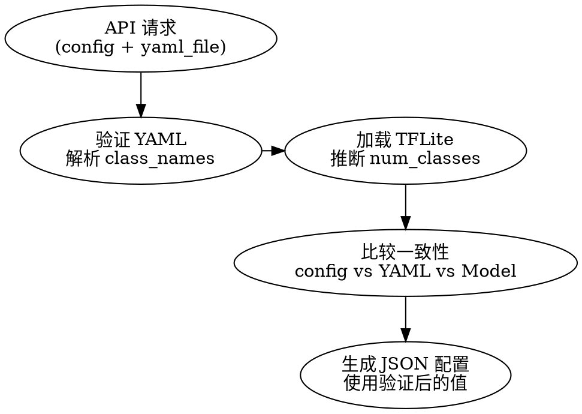

# class_names 和 num_classes 一致性检查报告

**检查日期**: 2026-03-12
**问题**: class_names 和 num_classes 是否与实际模型一致？

---

## 🚨 发现的问题

### 问题 1: yaml_path 未正确传递 ❌

**位置**: `backend/app/api/convert.py:376-385`

```python
# 准备配置字典（从 Pydantic 模型）
config_dict = config.dict()
config_dict["task_id"] = task_id

# ❌ 缺少：yaml_path 未添加到 config_dict
# config_dict["yaml_path"] = yaml_path

# 执行转换
output_path = converter.convert(
    model_path=model_path,
    config=config_dict,
    calib_dataset_path=calibration_path,
    progress_callback=progress_callback
    # ❌ 缺少：yaml_path 参数
)
```

**影响**:
- ❌ YAML 文件路径未传递给 `docker_adapter.convert_model()`
- ❌ `_prepare_ne301_project()` 无法读取 YAML 文件
- ❌ `class_names` 将为空列表 `[]`
- ❌ 检测结果无法正确映射到类别名称

---

### 问题 2: num_classes 依赖用户输入 ⚠️

**数据流**:

```
API 请求 (config JSON)
    ↓
config_dict["num_classes"]  (用户提供的值)
    ↓
docker_adapter.convert_model()
    ↓
_prepare_ne301_project()
    ↓
generate_ne301_json_config(num_classes=config["num_classes"])
    ↓
postprocess_params["num_classes"] = 用户提供的值
```

**风险**:
- ⚠️ 如果用户提供的 `num_classes` 与实际模型不匹配，会导致错误
- ⚠️ 没有从模型或 YAML 文件验证 `num_classes`

---

### 问题 3: class_names 依赖 YAML 文件 ⚠️

**数据流**:

```
YAML 文件 (可选)
    ↓
docker_adapter._prepare_ne301_project()
    ↓
if yaml_path exists:
    class_names = [cls['name'] for cls in yaml_data['classes']]
else:
    class_names = []  # ❌ 空列表
    ↓
generate_ne301_json_config(class_names=class_names)
    ↓
postprocess_params["class_names"] = class_names
```

**风险**:
- ⚠️ 如果用户未上传 YAML 文件，`class_names` 为空
- ⚠️ 如果 YAML 文件顺序与训练时不一致，检测结果错误
- ⚠️ 没有验证 `len(class_names) == num_classes`

---

## ✅ 修复方案

### 修复 1: 传递 yaml_path

**文件**: `backend/app/api/convert.py:376-385`

```python
# ✅ 修复：添加 yaml_path 到 config_dict
config_dict = config.dict()
config_dict["task_id"] = task_id
config_dict["yaml_path"] = yaml_path  # ⭐ 添加此行

# 执行转换
output_path = converter.convert(
    model_path=model_path,
    config=config_dict,
    calib_dataset_path=calibration_path,
    progress_callback=progress_callback
)
```

---

### 修复 2: 验证 num_classes 和 class_names 一致性

**文件**: `backend/app/core/docker_adapter.py:687-710`

```python
# 从 YAML 文件读取 class_names（如果提供）
class_names: List[str] = []
if yaml_path and Path(yaml_path).exists():
    try:
        with open(yaml_path, 'r') as f:
            yaml_data = yaml.safe_load(f)

        # 从 YAML 中提取 class names
        if 'classes' in yaml_data:
            class_names = [cls['name'] for cls in yaml_data['classes']]
            logger.info(f"✅ 从 YAML 文件读取到 {len(class_names)} 个类别")
    except Exception as e:
        logger.warning(f"⚠️  读取 YAML 文件失败: {e}，将使用空类别列表")

# ⭐ 新增：验证一致性
num_classes_from_config = config["num_classes"]
num_classes_from_yaml = len(class_names)

if class_names and num_classes_from_yaml != num_classes_from_config:
    logger.error(f"❌ num_classes 不一致！")
    logger.error(f"  config 中: {num_classes_from_config}")
    logger.error(f"  YAML 中: {num_classes_from_yaml}")
    raise ValueError(
        f"num_classes 不一致: config={num_classes_from_config}, "
        f"yaml={num_classes_from_yaml}"
    )

if class_names:
    logger.info(f"✅ num_classes 一致性验证通过: {num_classes_from_config}")
else:
    logger.warning(f"⚠️  未提供 YAML 文件，无法验证 num_classes")
    logger.warning(f"  使用 config 中的值: {num_classes_from_config}")
```

---

### 修复 3: 从模型推断 num_classes（可选）

**文件**: `backend/app/core/ne301_config.py:421-573`

```python
def generate_ne301_json_config(
    tflite_path: Path,
    model_name: str,
    input_size: int,
    num_classes: int,
    class_names: List[str],
    ...
) -> Dict:
    """生成 NE301 模型 JSON 配置"""

    # ⭐ 新增：从 TFLite 模型推断 num_classes
    output_scale, output_zero_point, output_shape = extract_tflite_quantization_params(tflite_path)

    if output_shape is not None and len(output_shape) > 1:
        inferred_num_classes = output_shape[1] - 4  # height - 4 (bbox)

        # 验证一致性
        if inferred_num_classes != num_classes:
            logger.warning(f"⚠️  num_classes 不一致！")
            logger.warning(f"  从模型推断: {inferred_num_classes}")
            logger.warning(f"  从参数传入: {num_classes}")
            logger.warning(f"  使用从模型推断的值: {inferred_num_classes}")
            num_classes = inferred_num_classes

    # 继续生成配置...
```

---

## 📊 当前状态总结

| 项目 | 状态 | 说明 |
|------|------|------|
| `num_classes` | ⚠️ 依赖用户输入 | 未验证，可能不一致 |
| `class_names` | ⚠️ 依赖 YAML | 可能为空或顺序错误 |
| `yaml_path` 传递 | ❌ **未传递** | **严重 bug** |
| 一致性验证 | ❌ 无 | 没有检查 num_classes 和 class_names 是否匹配 |

---

## 🔧 立即需要的修复

### 关键修复 (CRITICAL)

1. **修复 yaml_path 传递** (`backend/app/api/convert.py:377`)
   ```python
   config_dict["yaml_path"] = yaml_path
   ```

### 高优先级修复 (HIGH)

2. **添加一致性验证** (`backend/app/core/docker_adapter.py:700`)
   ```python
   if class_names and len(class_names) != config["num_classes"]:
       raise ValueError("num_classes 与 YAML 中的类别数量不一致")
   ```

### 中优先级修复 (MEDIUM)

3. **从模型推断 num_classes** (`backend/app/core/ne301_config.py:452`)
   - 从 TFLite 输出形状推断
   - 警告用户如果不一致
   - 使用推断的值

---

## ✅ 推荐的数据流



**验证步骤**:
1. 从 YAML 读取 `class_names` → `num_classes_yaml = len(class_names)`
2. 从 TFLite 输出形状推断 → `num_classes_model = output_shape[1] - 4`
3. 比较 `config["num_classes"]` vs `num_classes_yaml` vs `num_classes_model`
4. 如果不一致，发出警告并使用 `num_classes_model`

---

## 📝 测试场景

### 场景 1: 所有参数一致 ✅

**输入**:
```json
{
  "num_classes": 80,
  "yaml_file": "data.yaml"  // 包含 80 个类别
}
```

**预期**:
```
✅ num_classes 一致: 80
✅ class_names 读取成功: ["person", "bicycle", ...]
✅ JSON 配置生成成功
```

---

### 场景 2: num_classes 不一致 ⚠️

**输入**:
```json
{
  "num_classes": 80,
  "yaml_file": "data.yaml"  // 包含 3 个类别
}
```

**当前行为**:
```
❌ 无验证，直接使用 config["num_classes"] = 80
❌ JSON 配置中 num_classes=80, class_names 只有 3 个
❌ 检测结果错误
```

**修复后行为**:
```
❌ 一致性检查失败: config=80, yaml=3
❌ 抛出 ValueError
```

---

### 场景 3: 缺少 YAML 文件 ⚠️

**输入**:
```json
{
  "num_classes": 80,
  "yaml_file": null
}
```

**当前行为**:
```
⚠️  class_names = []
⚠️  JSON 配置中 num_classes=80, class_names=[]
⚠️  检测结果无法映射到类别名称
```

**修复后行为**:
```
⚠️  警告：未提供 YAML 文件，无法验证 num_classes
✅ 从模型推断 num_classes (如果 TFLite 已生成)
⚠️  class_names = [] (用户需要手动添加)
```

---

## 📚 参考

- **相关代码**:
  - `backend/app/api/convert.py:336-385` - API 端点
  - `backend/app/core/docker_adapter.py:660-740` - NE301 项目准备
  - `backend/app/core/ne301_config.py:421-573` - JSON 配置生成

- **相关文档**:
  - `NE301_JSON_QUICK_REFERENCE.md` - JSON 配置快速参考
  - `NE301_PACKAGING_CODE_ANALYSIS.md` - 打包流程分析

---

**检查完成时间**: 2026-03-12
**状态**: ❌ 发现严重 bug，需要立即修复
