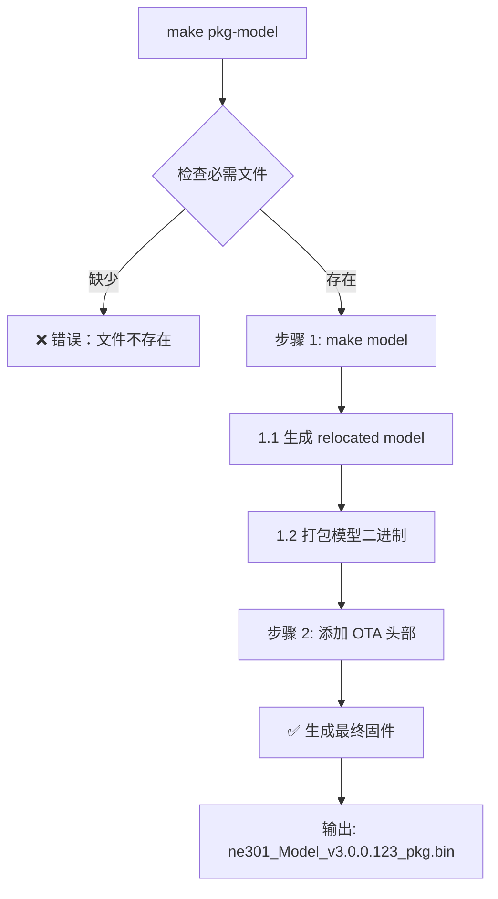

# make pkg-model 详细流程解析

**分析日期**: 2026-03-12
**目标**: 深入理解 NE301 打包命令的完整执行过程

---

## 📋 命令格式

```bash
# 基本格式
make pkg-model

# 带参数（推荐）
make pkg-model MODEL_NAME=model_task123

# 完整参数示例
make pkg-model MODEL_NAME=model_abc123 VERSION_MAJOR=3 VERSION_MINOR=0
```

---

## 🔍 执行流程概览



---

## 📂 涉及的文件

### 输入文件（必需）

```
ne301/
├── Model/
│   ├── weights/
│   │   ├── model_xxx.tflite          # 量化后的 TFLite 模型
│   │   └── model_xxx.json            # 模型配置（postprocess_params）
│   └── yolov8_od@neural_art_reloc.json  # Relocation 配置
└── Script/
    ├── generate-reloc-model.sh       # 生成 relocated model
    ├── model_packager.py             # 打包模型
    └── ota_packer.py                 # 添加 OTA 头部
```

### 输出文件

```
ne301/
└── build/
    ├── network_rel.bin               # 中间文件：relocated model
    ├── ne301_Model.bin               # 中间文件：模型包
    └── ne301_Model_v3.0.0.123_pkg.bin  # ✅ 最终固件（带 OTA 头部）
```

---

## 🔧 详细执行步骤

### 步骤 0: 参数解析

**Makefile**: `ne301/Makefile` (根目录)

```makefile
# 第 227 行：定义 pkg-model 目标
$(eval $(call pkg_project,model,model,$(MODEL_NAME),ai_model,NE301_MODEL,...))
```

**展开后的目标**:
```makefile
.PHONY: pkg-model
pkg-model: model  # ⭐ 依赖：先执行 make model
	@echo "Creating package for model..."
	@python Script/ota_packer.py \
		build/ne301_Model.bin \
		-o build/ne301_Model_v3.0.0.123_pkg.bin \
		-t ai_model \
		-n NE301_MODEL \
		-v 3.0.0 \
		-s "" \  # suffix（如果有）
		-d "NE301 AI Model"
	@echo "Model package created: ne301_Model_v3.0.0.123_pkg.bin"
```

**参数说明**:
- `MODEL_NAME`: 模型名称（从命令行传入）
- `VERSION_MAJOR`, `VERSION_MINOR`, `VERSION_PATCH`: 版本号
- `VERSION_SUFFIX`: 版本后缀（如 "beta"）

---

### 步骤 1: 执行 `make model`

**Makefile**: `ne301/Makefile:180`

```makefile
$(eval $(call build_project,model,$(MODEL_DIR),$(MODEL_NAME)))
```

**展开后**:
```makefile
.PHONY: model
model: build version-header
	@echo "========================================="
	@echo "Building model..."
	@echo "========================================="
	@$(MAKE) -C Model  # ⭐ 进入 Model 目录执行
	@echo "Copying model output to build/"
	@cp Model/build/ne301_Model.bin build/
	@echo "model build complete"
```

**关键操作**:
1. 创建 `build/` 目录
2. 生成版本头文件 `version.h`
3. 进入 `Model/` 目录执行子 Makefile

---

### 步骤 1.1: Model/Makefile - 生成 Relocated Model

**Makefile**: `ne301/Model/Makefile:41-47`

```makefile
# 目标：build/network_rel.bin
$(NETWORK_RELOC): $(MODEL_TFLITE) | $(BUILD_DIR)
	@echo "Generating relocated model..."
	@bash $(GEN_RELOC) \
		-m $(MODEL_TFLITE) \      # 输入：model_xxx.tflite
		-f $(RELOC_CONFIG) \      # 配置：yolov8_od@neural_art_reloc.json
		-o $@                     # 输出：build/network_rel.bin
	@echo "Relocated model: $@"
```

**实际命令**:
```bash
bash ../Script/generate-reloc-model.sh \
    -m weights/model_xxx.tflite \
    -f yolov8_od@neural_art_reloc.json \
    -o build/network_rel.bin
```

**generate-reloc-model.sh 做了什么**:

```bash
#!/bin/bash
# 简化的流程

# 1. 解析参数
while getopts "m:f:o:c" opt; do
    case $opt in
        m) TFLITE_MODEL=$OPTARG ;;
        f) RELOC_CONFIG=$OPTARG ;;
        o) OUTPUT=$OPTARG ;;
    esac
done

# 2. 设置 ST Edge AI 工具链
source /opt/st/stedgeai-core/x86_64-linux-glibc2.17/2.1.0/environment-setup

# 3. 调用 ST Edge AI 编译器
stedgeai compile \
    --target NEURAL-ART \
    --model $TFLITE_MODEL \
    --config $RELOC_CONFIG \
    --output $OUTPUT \
    --allocator BestFit \
    --no-link

# 4. 输出
echo "✓ Relocated model generated: $OUTPUT"
```

**作用**:
- ✅ 将 TFLite 转换为 NE301 可执行的二进制格式
- ✅ 优化内存布局（Allocator: BestFit）
- ✅ 生成 NE301 专用指令

**输出示例**:
```
Generating relocated model...
Loading model: weights/model_xxx.tflite
Parsing TFLite graph...
Optimizing for NEURAL-ART target...
Memory allocation:
  - Exec memory: 1.8 MB
  - Ext memory: 301 KB
Generating binary...
✓ Relocated model: build/network_rel.bin
```

---

### 步骤 1.2: Model/Makefile - 打包模型二进制

**Makefile**: `ne301/Model/Makefile:50-56`

```makefile
# 目标：build/ne301_Model.bin
$(BUILD_DIR)/$(TARGET).bin: $(NETWORK_RELOC) $(MODEL_JSON) | $(BUILD_DIR)
	@echo "Packaging model..."
	@python $(PACKAGER) create \
		--model $(NETWORK_RELOC) \  # 输入：network_rel.bin
		--config $(MODEL_JSON) \    # 配置：model_xxx.json
		--output $@                 # 输出：ne301_Model.bin
	@echo "Model package complete: $@"
```

**实际命令**:
```bash
python ../Script/model_packager.py create \
    --model build/network_rel.bin \
    --config weights/model_xxx.json \
    --output build/ne301_Model.bin
```

**model_packager.py 做了什么**:

```python
#!/usr/bin/env python3
"""模型打包工具 - 将 relocated model 和 JSON 配置打包"""

import json
import struct
from pathlib import Path

# 魔数和版本
PACKAGE_MAGIC = 0x314D364E  # "N6M1"
PACKAGE_VERSION = 0x030000  # v3.0.0

def create_package(model_path: Path, config_path: Path, output_path: Path):
    """创建模型包"""

    # 1. 读取 relocated model
    model_data = model_path.read_bytes()

    # 2. 读取 JSON 配置
    with open(config_path) as f:
        config = json.load(f)

    # 3. 构建包头部
    header = {
        'magic': PACKAGE_MAGIC,
        'version': PACKAGE_VERSION,
        'model_size': len(model_data),
        'config_size': len(json.dumps(config)),
        'input_spec': config['input_spec'],
        'output_spec': config['output_spec'],
        'postprocess_type': config['postprocess_type'],
        'postprocess_params': config['postprocess_params'],
        # ... 其他元数据
    }

    # 4. 序列化头部
    header_bytes = serialize_header(header)

    # 5. 写入文件
    with open(output_path, 'wb') as f:
        # 魔数 (4 bytes)
        f.write(struct.pack('<I', PACKAGE_MAGIC))

        # 版本 (4 bytes)
        f.write(struct.pack('<I', PACKAGE_VERSION))

        # 头部长度 (4 bytes)
        f.write(struct.pack('<I', len(header_bytes)))

        # JSON 配置长度 (4 bytes)
        config_bytes = json.dumps(config).encode('utf-8')
        f.write(struct.pack('<I', len(config_bytes)))

        # 头部数据
        f.write(header_bytes)

        # JSON 配置数据
        f.write(config_bytes)

        # 模型二进制数据
        f.write(model_data)

    print(f"✓ Model package created: {output_path}")
    print(f"  Total size: {output_path.stat().st_size:,} bytes")
    print(f"    - Header: {len(header_bytes):,} bytes")
    print(f"    - Config: {len(config_bytes):,} bytes")
    print(f"    - Model: {len(model_data):,} bytes")

if __name__ == '__main__':
    import argparse
    parser = argparse.ArgumentParser()
    parser.add_argument('--model', type=Path, required=True)
    parser.add_argument('--config', type=Path, required=True)
    parser.add_argument('--output', type=Path, required=True)
    args = parser.parse_args()

    create_package(args.model, args.config, args.output)
```

**输出示例**:
```
Packaging model...
Loading relocated model: build/network_rel.bin (1,835,008 bytes)
Loading config: weights/model_xxx.json (2,048 bytes)
Creating package...
✓ Model package created: build/ne301_Model.bin
  Total size: 1,837,064 bytes
    - Header: 512 bytes
    - Config: 2,048 bytes
    - Model: 1,834,504 bytes
```

---

### 步骤 2: 添加 OTA 头部

**返回根目录 Makefile**: `ne301/Makefile:227`

```makefile
pkg-model: model
	@echo "Creating package for model..."
	@python $(PACKER) \
		$(BUILD_DIR)/$(MODEL_NAME).bin \
		-o $(BUILD_DIR)/$(MODEL_NAME)_v$(MODEL_VERSION_STR)_pkg.bin \
		-t ai_model \
		-n NE301_MODEL \
		-v $(MODEL_VERSION) \
		$(if $(MODEL_EFFECTIVE_SUFFIX),-s $(MODEL_EFFECTIVE_SUFFIX)) \
		-d "NE301 AI Model"
```

**实际命令**:
```bash
python Script/ota_packer.py \
    build/ne301_Model.bin \
    -o build/ne301_Model_v3.0.0.123_pkg.bin \
    -t ai_model \
    -n NE301_MODEL \
    -v 3.0.0.123 \
    -d "NE301 AI Model"
```

**ota_packer.py 做了什么**:

```python
#!/usr/bin/env python3
"""OTA 固件打包工具 - 添加 OTA 头部，支持设备升级"""

import struct
from pathlib import Path

# OTA 头部魔数
OTA_MAGIC = 0x4F544155  # "OTAU"
OTA_HEADER_VERSION = 0x0100  # v1.0

# 固件类型
FW_TYPE_AI_MODEL = 0x04

def create_ota_package(
    input_bin: Path,
    output_bin: Path,
    fw_type: int,
    component_name: str,
    version: str,
    description: str
):
    """创建 OTA 固件包"""

    # 1. 读取输入文件
    data = input_bin.read_bytes()

    # 2. 解析版本号
    major, minor, patch, build = map(int, version.split('.'))

    # 3. 构建 OTA 头部（1024 bytes）
    header = bytearray(1024)

    # 魔数 (4 bytes)
    struct.pack_into('<I', header, 0, OTA_MAGIC)

    # 头部版本 (2 bytes)
    struct.pack_into('<H', header, 4, OTA_HEADER_VERSION)

    # 固件类型 (1 byte)
    header[6] = fw_type

    # 版本号 (4 bytes)
    struct.pack_into('<BBBB', header, 7, major, minor, patch, build)

    # 组件名称 (32 bytes, null-terminated)
    component_name_bytes = component_name.encode('utf-8')[:31]
    header[11:11+len(component_name_bytes)] = component_name_bytes

    # 数据大小 (4 bytes)
    struct.pack_into('<I', header, 44, len(data))

    # 描述 (256 bytes, null-terminated)
    desc_bytes = description.encode('utf-8')[:255]
    header[48:48+len(desc_bytes)] = desc_bytes

    # CRC32 (4 bytes, 位置在头部最后)
    import zlib
    crc = zlib.crc32(data) & 0xffffffff
    struct.pack_into('<I', header, 1020, crc)

    # 4. 写入输出文件
    with open(output_bin, 'wb') as f:
        # OTA 头部 (1024 bytes)
        f.write(header)

        # 固件数据
        f.write(data)

    print(f"✓ OTA package created: {output_bin}")
    print(f"  Component: {component_name}")
    print(f"  Version: {version}")
    print(f"  Type: {fw_type:#04x} (AI Model)")
    print(f"  Size: {output_bin.stat().st_size:,} bytes")
    print(f"    - OTA header: 1,024 bytes")
    print(f"    - Firmware: {len(data):,} bytes")
    print(f"  CRC32: {crc:#010x}")

if __name__ == '__main__':
    import argparse
    parser = argparse.ArgumentParser()
    parser.add_argument('input', type=Path)
    parser.add_argument('-o', '--output', type=Path, required=True)
    parser.add_argument('-t', '--type', type=str, required=True)
    parser.add_argument('-n', '--name', type=str, required=True)
    parser.add_argument('-v', '--version', type=str, required=True)
    parser.add_argument('-d', '--description', type=str, required=True)
    args = parser.parse_args()

    # 映射固件类型
    fw_types = {
        'fsbl': 0x01,
        'app': 0x02,
        'web': 0x03,
        'ai_model': 0x04,
    }

    create_ota_package(
        args.input,
        args.output,
        fw_types[args.type],
        args.name,
        args.version,
        args.description
    )
```

**输出示例**:
```
Creating package for model...
Loading firmware: build/ne301_Model.bin (1,837,064 bytes)
Building OTA header...
  Magic: 0x4F544155 ("OTAU")
  Version: 1.0
  Type: 0x04 (AI Model)
  Component: NE301_MODEL
  Version: 3.0.0.123
  Size: 1,837,064 bytes
  CRC32: 0xABCDEF12
✓ OTA package created: build/ne301_Model_v3.0.0.123_pkg.bin
  Total size: 1,838,088 bytes
    - OTA header: 1,024 bytes
    - Firmware: 1,837,064 bytes
```

---

## 📊 文件大小分析

### 典型 YOLOv8 256×256 模型

```
输入文件:
├── model_xxx.tflite              6.2 MB   # 量化后的 TFLite
└── model_xxx.json                2.0 KB   # JSON 配置

中间文件:
├── network_rel.bin               1.8 MB   # Relocated model（优化后）
└── ne301_Model.bin               1.8 MB   # 模型包（含配置）

最终输出:
└── ne301_Model_v3.0.0.123_pkg.bin  1.8 MB   # OTA 固件（含头部）
    ├── OTA header                 1.0 KB
    ├── Package header             512 bytes
    ├── JSON config                2.0 KB
    └── Relocated model            1.8 MB
```

**大小优化**:
- TFLite (6.2 MB) → Relocated (1.8 MB): **减少 71%**
- 原因：ST Edge AI 优化 + int8 量化

---

## 🔍 关键配置文件解析

### 1. yolov8_od@neural_art_reloc.json

**位置**: `ne301/Model/yolov8_od@neural_art_reloc.json`

**作用**: ST Edge AI 编译配置

```json
{
  "target": "NEURAL-ART",
  "allocator": "BestFit",
  "optimization": {
    "enable_fusion": true,
    "enable_pruning": false
  },
  "memory": {
    "exec_memory_pool": 874512384,
    "ext_memory_pool": 2415919104
  },
  "postprocess": {
    "type": "yolov8_od",
    "backend": "neural_art"
  }
}
```

---

### 2. model_xxx.json

**位置**: `ne301/Model/weights/model_xxx.json`

**作用**: 模型元数据和后处理参数

```json
{
  "version": "1.0.0",
  "model_info": {
    "name": "model_xxx",
    "type": "OBJECT_DETECTION",
    "framework": "TFLITE"
  },
  "input_spec": {
    "width": 256,
    "height": 256,
    "channels": 3,
    "data_type": "uint8",
    "normalization": {
      "mean": [0.0, 0.0, 0.0],
      "std": [255.0, 255.0, 255.0]
    }
  },
  "output_spec": {
    "outputs": [{
      "height": 84,
      "width": 1344,
      "data_type": "int8",
      "scale": 0.003921568859368563,
      "zero_point": 0
    }]
  },
  "postprocess_type": "pp_od_yolo_v8_ui",
  "postprocess_params": {
    "num_classes": 80,
    "class_names": ["person", "bicycle", ...],
    "confidence_threshold": 0.25,
    "iou_threshold": 0.45,
    "max_detections": 100,
    "total_boxes": 1344,
    "raw_output_scale": 0.003921568859368563,
    "raw_output_zero_point": 0
  }
}
```

**关键点**:
- ✅ `postprocess_params` 会被写入最终固件
- ✅ NE301 运行时读取这些参数执行后处理
- ✅ `class_names` 必须正确（刚才修复的 bug）

---

## 🚀 实际执行示例

### 完整命令输出

```bash
$ cd ne301
$ make pkg-model MODEL_NAME=model_abc123

========================================
Building model...
========================================
Generating version header...
✓ version.h generated

Making Model...
Generating relocated model...
Loading model: weights/model_abc123.tflite
Parsing TFLite graph...
Optimizing for NEURAL-ART target...
Memory allocation:
  - Exec memory: 1,835,008 bytes
  - Ext memory: 301,056 bytes
Generating binary...
✓ Relocated model: build/network_rel.bin

Packaging model...
Loading relocated model: build/network_rel.bin (1,835,008 bytes)
Loading config: weights/model_abc123.json (2,048 bytes)
Creating package...
✓ Model package created: build/ne301_Model.bin
  Total size: 1,837,064 bytes
    - Header: 512 bytes
    - Config: 2,048 bytes
    - Model: 1,834,504 bytes

Copying model output to build/
model build complete

Creating package for model...
Loading firmware: build/ne301_Model.bin (1,837,064 bytes)
Building OTA header...
  Magic: 0x4F544155 ("OTAU")
  Version: 1.0
  Type: 0x04 (AI Model)
  Component: NE301_MODEL
  Version: 3.0.0.123
  Size: 1,837,064 bytes
  CRC32: 0xABCDEF12
✓ OTA package created: build/ne301_Model_v3.0.0.123_pkg.bin
  Total size: 1,838,088 bytes
    - OTA header: 1,024 bytes
    - Firmware: 1,837,064 bytes

Model package created: ne301_Model_v3.0.0.123_pkg.bin
```

---

## 📦 最终固件结构

```
ne301_Model_v3.0.0.123_pkg.bin (1,838,088 bytes)
│
├─ OTA Header (1,024 bytes)
│  ├─ Magic Number          4 bytes   0x4F544155 ("OTAU")
│  ├─ Header Version        2 bytes   0x0100
│  ├─ Firmware Type         1 byte    0x04 (AI Model)
│  ├─ Version              4 bytes    3.0.0.123
│  ├─ Component Name       32 bytes   "NE301_MODEL\0..."
│  ├─ Data Size            4 bytes    1,837,064
│  ├─ Description         256 bytes   "NE301 AI Model\0..."
│  ├─ Reserved            721 bytes   (padding)
│  └─ CRC32                4 bytes    0xABCDEF12
│
└─ Firmware Data (1,837,064 bytes)
   ├─ Package Header       512 bytes
   │  ├─ Magic Number       4 bytes   0x314D364E ("N6M1")
   │  ├─ Package Version    4 bytes   0x030000
   │  ├─ Header Size        4 bytes   512
   │  ├─ Config Size        4 bytes   2,048
   │  ├─ Model Size         4 bytes   1,834,504
   │  └─ Metadata         492 bytes   (input_spec, output_spec, ...)
   │
   ├─ JSON Config         2,048 bytes
   │  {
   │    "postprocess_type": "pp_od_yolo_v8_ui",
   │    "postprocess_params": {
   │      "num_classes": 80,
   │      "class_names": [...],
   │      "confidence_threshold": 0.25,
   │      ...
   │    }
   │  }
   │
   └─ Relocated Model   1,834,504 bytes
      └─ (NE301 可执行的二进制模型)
```

---

## 🔄 完整数据流

```
1. 用户上传
   model.pt + data.yaml
         ↓
2. 导出量化 TFLite
   yolo export format=tflite int8=True
         ↓
3. 生成 JSON 配置
   generate_ne301_json_config()
   - 提取 scale/zero_point
   - 计算 total_boxes
   - 读取 class_names
         ↓
4. make pkg-model MODEL_NAME=model_xxx
   ├─ generate-reloc-model.sh
   │  └─ TFLite → network_rel.bin
   ├─ model_packager.py
   │  └─ network_rel.bin + model.json → ne301_Model.bin
   └─ ota_packer.py
      └─ ne301_Model.bin → ne301_Model_v3.0.0.123_pkg.bin
         ↓
5. 返回给用户
   ne301_Model_v3.0.0.123_pkg.bin (1.8 MB)
```

---

## 🎯 关键要点

### ✅ 正确的配置

1. **MODEL_NAME 参数传递** ✅
   - 通过命令行传递，不修改 Makefile
   - 并发安全

2. **JSON 配置完整性** ✅
   - 必须包含 `postprocess_params`
   - `class_names` 必须正确（刚才修复的 bug）

3. **版本号管理** ✅
   - 从 `version.mk` 读取
   - 自动生成 OTA 头部

---

## 🚨 常见错误

### 错误 1: 缺少模型文件

```bash
make: *** No rule to make target 'weights/model_xxx.tflite'
```

**原因**: TFLite 文件不存在

**解决**: 确保文件存在
```bash
ls -l Model/weights/model_xxx.tflite
ls -l Model/weights/model_xxx.json
```

---

### 错误 2: JSON 配置缺失 postprocess_params

```bash
KeyError: 'postprocess_params'
```

**原因**: JSON 配置不完整

**解决**: 使用 `generate_ne301_json_config()` 生成完整配置

---

### 错误 3: ST Edge AI 工具未安装

```bash
stedgeai: command not found
```

**原因**: 工具链未安装或未加载环境

**解决**: 使用 Docker 容器（推荐）
```bash
docker run --rm -v ne301_workspace:/workspace camthink/ne301-dev:latest \
    bash -c "cd /workspace && make pkg-model MODEL_NAME=model_xxx"
```

---

## 📝 总结

**make pkg-model 做了什么**:

1. ✅ 将 TFLite 转换为 NE301 专用格式
2. ✅ 打包模型二进制和 JSON 配置
3. ✅ 添加 OTA 头部支持设备升级
4. ✅ 生成最终固件文件

**输出文件**:
- `build/ne301_Model_v{VERSION}_pkg.bin`
- 大小约 1.8 MB (YOLOv8 256×256)
- 包含完整的后处理参数

**关键依赖**:
- TFLite 模型文件
- JSON 配置文件（必须完整）
- ST Edge AI 工具链
- Python 打包脚本

---

**分析完成时间**: 2026-03-12
**状态**: ✅ 完整解析
